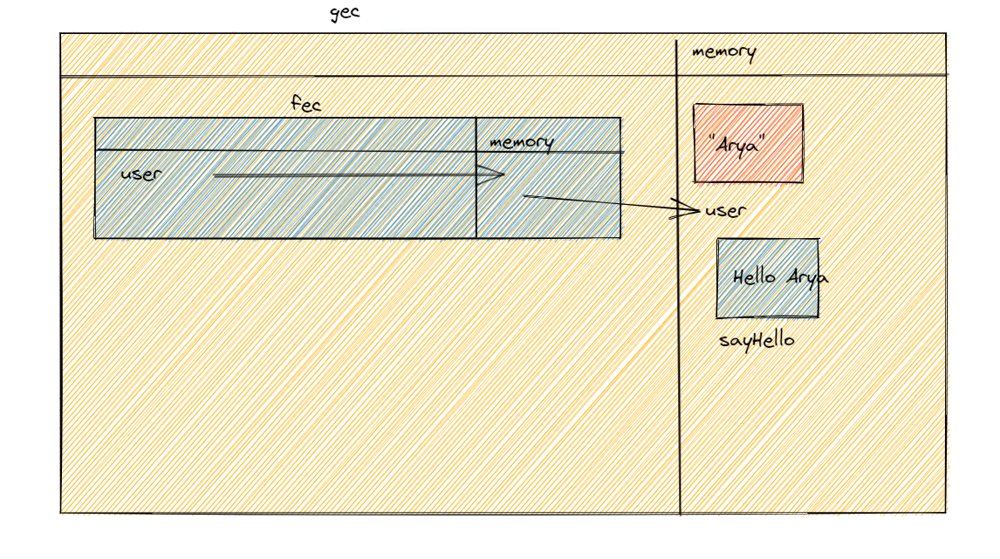
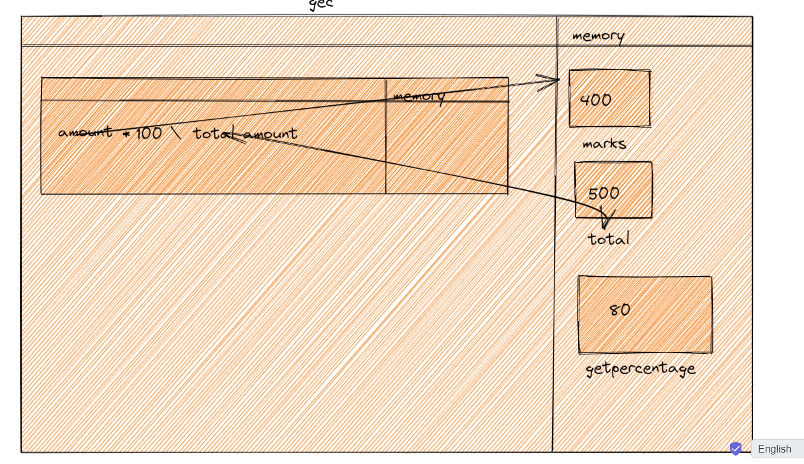

1. What does thread of execution means in JavaScript?
   Thread of excecution means how the code gets excecuted in javascript engine
2. Where the JavaScript code gets executed?
   Javascript code gets excecuted in Javscript engine
3. What does context means in Global Execution Context?
   Context means an environment in which we are excecuting the code.
4. When do you create a global execution context.
   global excecution context is the first excecution context that is created only once by javascript engine
5. Execution context consists of what all things?
   memory function excecution
6. What are the different types of execution context?
   global excecution context and function excecution context
7. When global and function execution context gets created?
   global excecution context gets created only once at the start od code excecution
   and function excecution context gets created every time the function gets excecuted.
8. Function execution gets created during function execution or while declaring a function.
   during function excecution
9. Create a execution context diagram of the following code on your notebook. Take a screenshot/photo and store it in the folder named `img`. Use `` to display it here.

```js
var user = "Arya";

function sayHello() {
  return `Hello ${user}`;
}

var userMsg = sayHello(user);
```

<!-- Put your image here -->



```js
var marks = 400;
var total = 500;

function getPercentage(amount, totalAmount) {
  return (amount * 100) / totalAmount;
}

var percentageMarks = getPercentage(marks, total);
var percentageProfit = getPercentage(400, 200);
```

<!-- Put your image here -->



```js
var age = 21;

function customeMessage(userAge) {
  if (userAge > 18) {
    return `You are an adult`;
  } else {
    return `You are a kid`;
  }
}

var whoAmI = customeMessage(age);
var whoAmIAgain = customeMessage(12);
```

<!-- Put your image here -->


